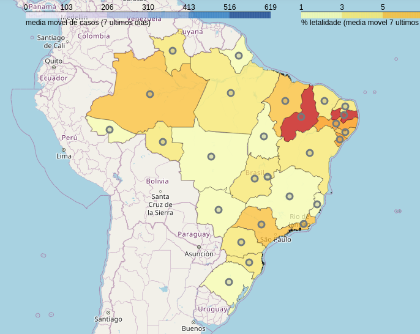

# **Análises do Coronavirus de uma perspectiva brasileira**

[
English version](README_EN.md)

Desde que o vírus chegou aqui no Brasil, iniciei algumas análises sobre dados de contaminações, mortes e recuperações da pandemia pelo mundo, a fim de entender, comparar e até prever seu comportamento aqui no Brasil.

Como esse conteúdo pode ser útil para outras pessoas, além de mim e meus amigos, decidi compartilhá-lo aqui. Se for útil para você, ficarei feliz em ajudar.
Eu o atualizo diariamente por volta das 07h da manhã (horário de Brasília)
-----------------

## Análises do Brasil

[  Click here for updated map](analysis/BrazilMap.html)

[As análises detalhadas sobre a pandemia no Brasil encontram-se aqui](analysis/README.md).

## Análises do Mundo
[Análises da pandemia pelo mundo comparando com o Brasil encontram-se aqui.](analysis/README_WORLD.md).

## Predições do Brasil (em construção)
[Aqui estão detalhes das predições para os próximos dias dos estados do Brasil](predictions/README.md).

## Predições do Mundo
[Aqui estão detalhes das predições para os próximos dias para alguns países do mundo e Brasil](predictions/README_WORLD.md).

------------------
## Sobre este estudo

Gostaria de agradecer ao Pomber [https://github.com/pomber/covid19](https://github.com/pomber/covid1) que provê um JSON com os dados mundiais do covid-19 a partir do [CSSEGISandData/COVID-19](https://github.com/CSSEGISandData/COVID-19), o qual é o principal conjunto de dados para este conteúdo. Também agradeco ao [ebwinters](https://github.com/NovelCOVID/API/commits?author=ebwinters) e ao pessoal do projeto [https://github.com/novelcovid/api](https://github.com/novelcovid/api), que provêm dados de geolocalização de todos os países.
Fica a dica para visitare estes projetos e conhecer um pouco mais sobre estes dados.

A seguir estão todas as informações detalhadas sobre este estudo, assim como os jupyter-notebooks utilizados:

#### Dados de entrada
Estes são os dados obtidos externamente para produção dos *datasets* (conjuntos de dados) usados nesta análise:
* JSON do Pomber [Pomber [(https://github.com/pomber/covid19)]]: dados da pandemia convid-19 por todos os países do mundo.
* [API](https://github.com/novelcovid/api) do  ebwinter: dados de geográficos de todos os países
* [dataset](#https://population.un.org/wpp/Download/Standard/CSV/) da ONU com dados demográficos de (quase) todos os países.
* [brasil-estados.json](data/brasil-estados.json): um arquivo JSON contendo todos os dados geográficos dos estatos brasileiros obtido a partir da [API do IBGE](https://servicodados.ibge.gov.br/api/v2/malhas/?formato=application/vnd.geo+json&resolucao=2). Estes dados são usados para desenhar o os estados sobre o mapa o Brasil.
* [brazilian_states.csv](data/brazilian_states.csv): dados descritivos de todos os estados brasileiros, também obtidos a partir da [API do IBGE](https://servicodados.ibge.gov.br/api/v1/localidades/estados/)
* [gov_brazil_corona19_data.csv](data/gov_brazil_corona19_data.csv): dados atualizados da pandemia no Brasil provido pelo [Ministério da Saúde](https://covid.saude.gov.br/).

### Dataset
* **[world_countries_2019.csv](data/world_countries_2019.csv)**: um *dataset* consolidado a partir dos dados do ebinters e da ONU, o qual é usado para normalizar alguns indicadores da pandemia a partir das populações de cada país.
* **[world_corona19_data.csv](data/world_corona19_data.csv)**: o *dataset* principal usado por este estuddo. É composto a partir do JSON do Pomber e enriquecido com as seguintes *features*, que são derivadas para **casos**, **mortes** e **recuperações**, porém, para simplificar, apresento-as para **caso** (estão em inglês para facilitar o compartilhamento de conteúdo):
    * *day*: número de dias a partir do primeiro caso de contaminação no país
    * *cases*: número acumulado de casos desde o dia (*day*) 0
    * *case_day*: número de casos registrados em um determinado dia
    * *%var_case_day*: variação diária de casos em relação ao dia anterior (em percentual)
    * *cases_million*: número de casos diário por milhão de habitantes de um país. É o que permite uma melhor comparação mais adequada dos dados entre países
    * *avg7_cases*: média móvel de casos diários dos últimos 7 dias
    * *avg7_cases_million*: média móvel de casos por milhão dos últimos 7 dias 
    * *perc_death*: percentual de mortes sobre a quantidade de casos de contaminação de um país

### Notebooks
Aqui estão os jupyter-notebooks que usei para criar este estudo:

 *[countries_data_aggregator.ipynb](notebooks/countries_data_aggregator.ipynb)*: o agregador de todos os dados de todos os países e estados do Brasil.

 *[data_engineering.ipynb](notebooks/data_engineering.ipynb)*: engenharia de dados e de *features* para composição do *dataset* principal.

 *[analysis.ipynb](notebooks/analysis.ipynb)*: todas as análises e gráficos feitos sobre a pandemia no mundo e no Brasil.

 *[brazil_analysis.ipynb](notebooks/brazil_analysis.ipynb)*: todas as análises e gráficos sobre a pandemia no Brasil.

 *[prediction.ipynb](notebooks/prediction.ipynb)*: todas as predições da pandemia no mudo e no Brasil usando [Facebook-Prophet](https://facebook.github.io/prophet/docs/quick_start.html).

 *[brazilian_prediction.ipynb](notebooks/brazilian_prediction.ipynb)*: todas as predições da pandemia pelos estados do Brasil usando [Facebook-Prophet](https://facebook.github.io/prophet/docs/quick_start.html).