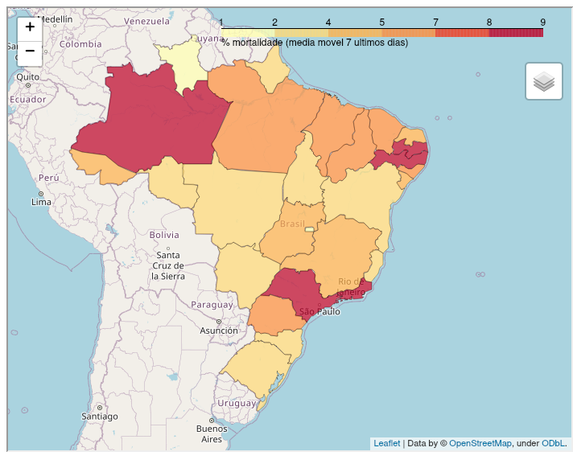
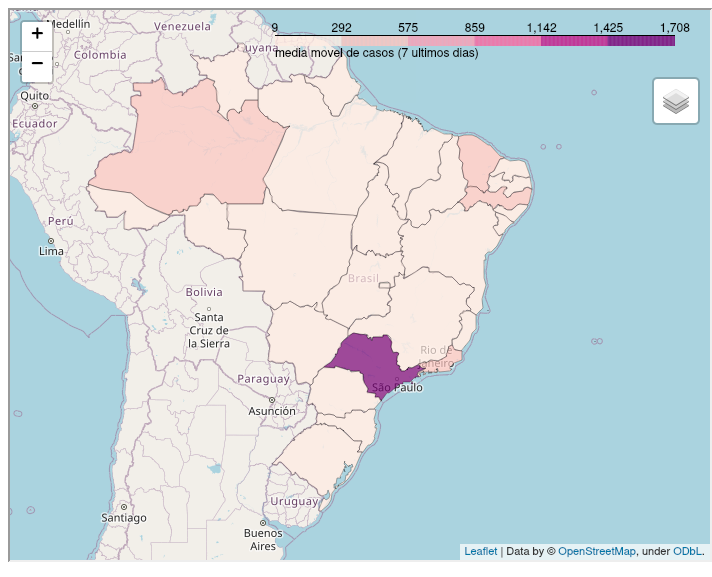

[ English version](README_EN.md)

# **Análises e monitoramento**

### Letalidade dos estados brasileiros
O nível de letalidade demonstrado no mapa é definido a partir da média móvel dos últimos 7 dias da letalidade de cada estado.

### Transmissão dos estados brasileiros
O nível de transmissão no mapa é definido a partir da média móvel dos últimos 7 dias da quantidade de casos acumulados de cada estado.

Estas análises são relativas aos dados da pandemia Covid19 no Brasil até a data de **2020-04-28**.

Como existem muitos estados, colocar em um único gráfico todos seus dados tornaria a leitura e compreensão inviáveis, desta forma, foram selecionados os 10 mais mortais:['PB' 'RJ' 'PE' 'SP' 'AM' 'AL' 'PI' 'PR' 'CE' 'SE'].

***Dica**: você mesmo pode alterar neste notebook quais estados você prefere comparar.*

## Top 10 estados mais letais do Brasil
|    | state   | date                |   day |   case_day |   cases |   death_day |   deaths |   avg7_cases |   avg7_deaths |   avg7_perc_death |   perc_death |
|---:|:--------|:--------------------|------:|-----------:|--------:|------------:|---------:|-------------:|--------------:|------------------:|-------------:|
|  1 | PB      | 2020-04-28 00:00:00 |    41 |         90 |     633 |           3 |       53 |           52 |             2 |             10.52 |         8.37 |
|  2 | RJ      | 2020-04-28 00:00:00 |    55 |        560 |    8504 |          61 |      738 |          456 |            39 |              8.82 |         8.68 |
|  3 | PE      | 2020-04-28 00:00:00 |    48 |        366 |    5724 |          58 |      508 |          402 |            35 |              8.63 |         8.87 |
|  4 | SP      | 2020-04-28 00:00:00 |    63 |       2345 |   24041 |         224 |     2049 |         1236 |           136 |              8.16 |         8.52 |
|  5 | AM      | 2020-04-28 00:00:00 |    45 |        409 |    4337 |          31 |      351 |          295 |            22 |              8.07 |         8.09 |
|  6 | AL      | 2020-04-28 00:00:00 |    52 |        134 |     777 |           2 |       36 |           81 |             2 |              6.15 |         4.63 |
|  7 | PI      | 2020-04-28 00:00:00 |    40 |         44 |     408 |           1 |       21 |           31 |             1 |              6.03 |         5.15 |
|  8 | PR      | 2020-04-28 00:00:00 |    48 |         85 |    1271 |           2 |       77 |           35 |             3 |              5.9  |         6.06 |
|  9 | CE      | 2020-04-28 00:00:00 |    43 |        192 |    6918 |          13 |      403 |          457 |            26 |              5.8  |         5.83 |
| 10 | SE      | 2020-04-28 00:00:00 |    45 |         83 |     280 |           1 |       11 |           26 |             0 |              5.51 |         3.93 |

 ## Top 10 estados mais transmissíveis do Brasil
|    | state   | date                |   day |   case_day |   cases |   death_day |   deaths |   avg7_cases |   avg7_deaths |   avg7_perc_death |   perc_death |
|---:|:--------|:--------------------|------:|-----------:|--------:|------------:|---------:|-------------:|--------------:|------------------:|-------------:|
|  1 | SP      | 2020-04-28 00:00:00 |    63 |       2345 |   24041 |         224 |     2049 |         1236 |           136 |              8.16 |         8.52 |
|  2 | CE      | 2020-04-28 00:00:00 |    43 |        192 |    6918 |          13 |      403 |          457 |            26 |              5.8  |         5.83 |
|  3 | RJ      | 2020-04-28 00:00:00 |    55 |        560 |    8504 |          61 |      738 |          456 |            39 |              8.82 |         8.68 |
|  4 | PE      | 2020-04-28 00:00:00 |    48 |        366 |    5724 |          58 |      508 |          402 |            35 |              8.63 |         8.87 |
|  5 | AM      | 2020-04-28 00:00:00 |    45 |        409 |    4337 |          31 |      351 |          295 |            22 |              8.07 |         8.09 |
|  6 | PA      | 2020-04-28 00:00:00 |    41 |        134 |    2262 |          15 |      129 |          176 |            13 |              4.98 |         5.7  |
|  7 | MA      | 2020-04-28 00:00:00 |    39 |        118 |    2528 |          20 |      145 |          161 |            12 |              4.81 |         5.74 |
|  8 | BA      | 2020-04-28 00:00:00 |    54 |        186 |    2540 |          10 |       86 |          150 |             5 |              3.27 |         3.39 |
|  9 | ES      | 2020-04-28 00:00:00 |    54 |         78 |    1874 |           7 |       64 |           94 |             4 |              3.03 |         3.42 |
| 10 | AL      | 2020-04-28 00:00:00 |    52 |        134 |     777 |           2 |       36 |           81 |             2 |              6.15 |         4.63 |
----------------------
## Casos e mortes

 [Comparativos do Brasil com outro países do mundo podem ser encontratos aqui.](https://github.com/rafaelcastellar/coronavirus/blob/master/analysis/README_WORLD.md#an%C3%A1lises-do-brasil)