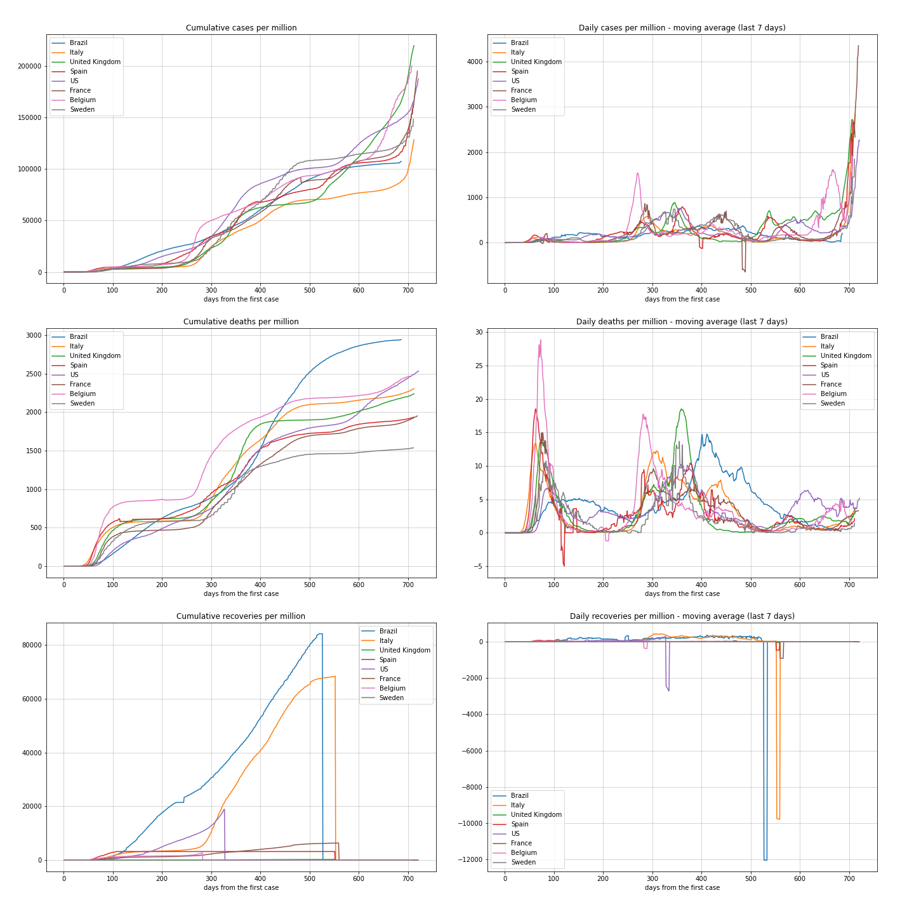

# **Analysis and monitoring**
These analysis are related to the Covid19 pandemic data up to **2020-04-09**.

As there are many countries to have all of their data plotted together, I selected a few of them plus Brazil to be compared with:['Brazil', 'Italy', 'United Kingdom', 'Spain', 'US', 'China', 'France'].
Some countries are not in UN dataset, so we can not analyse them by population. They can be found at the end of the *[data_engineering.ipynb](../data_engineering.ipynb)*.
*Tip: you can set yourself at the analysis notebook which countries you prefer to compare*

## Top 5 deadliest countries + Brazil
|     | country    |   day | date                |   cases |   case_day |   deaths |   death_day |   cases_million |   deaths_million |   avg7_cases_million |   avg7_deaths_million |   avg7_recoveries_million |
|----:|:-----------|------:|:--------------------|--------:|-----------:|---------:|------------:|----------------:|-----------------:|---------------------:|----------------------:|--------------------------:|
|   1 | San Marino |    42 | 2020-04-08 00:00:00 |     279 |          0 |       34 |           0 |             0   |              0   |                  181 |                    33 |                       113 |
|   2 | Belgium    |    65 | 2020-04-08 00:00:00 |   23403 |       1209 |     2240 |         205 |           104.8 |             17.8 |                  116 |                    17 |                        31 |
|   3 | Spain      |    68 | 2020-04-08 00:00:00 |  148220 |       6278 |    14792 |         747 |           134.3 |             16   |                  134 |                    16 |                        77 |
|   4 | Andorra    |    38 | 2020-04-08 00:00:00 |     564 |         19 |       23 |           1 |           246.3 |             13   |                  322 |                    16 |                        77 |
|   5 | France     |    76 | 2020-04-08 00:00:00 |  113959 |       3894 |    10887 |         544 |            59.8 |              8.4 |                  123 |                    15 |                        22 |
| 138 | Brazil     |    43 | 2020-04-08 00:00:00 |   16170 |       2136 |      819 |         133 |            10.1 |              0.6 |                    6 |                     0 |                         0 |

 ## Top 5 most transmissible countries + Brazil
|    | country    |   day | date                |   cases |   case_day |   deaths |   death_day |   cases_million |   deaths_million |   avg7_cases_million |   avg7_deaths_million |   avg7_recoveries_million |
|---:|:-----------|------:|:--------------------|--------:|-----------:|---------:|------------:|----------------:|-----------------:|---------------------:|----------------------:|--------------------------:|
|  1 | Andorra    |    38 | 2020-04-08 00:00:00 |     564 |         19 |       23 |           1 |           246.3 |             13   |                  322 |                    16 |                        77 |
|  2 | San Marino |    42 | 2020-04-08 00:00:00 |     279 |          0 |       34 |           0 |             0   |              0   |                  181 |                    33 |                       113 |
|  3 | Iceland    |    41 | 2020-04-08 00:00:00 |    1616 |         30 |        6 |           0 |            88.5 |              0   |                  166 |                     1 |                       171 |
|  4 | Luxembourg |    40 | 2020-04-08 00:00:00 |    3034 |         64 |       46 |           2 |           103.9 |              3.2 |                  165 |                     3 |                        97 |
|  5 | Spain      |    68 | 2020-04-08 00:00:00 |  148220 |       6278 |    14792 |         747 |           134.3 |             16   |                  134 |                    16 |                        77 |
| 57 | Brazil     |    43 | 2020-04-08 00:00:00 |   16170 |       2136 |      819 |         133 |            10.1 |              0.6 |                    6 |                     0 |                         0 |
----------------------
## World' analysis
### Cases and deaths

 ### Cases and deaths per million
Million of population normalizes the features so they can me better comparable among the selected countries. As we can see, the first charts shows us how aggressive the pandemic is in Italy, Spain and somehow in France.

 ### Active cases, world overview, % recoveries and lethality

----------------------
## Brazil's analysis

 ### Cases, deaths and recoveries

 ### Moving averages (last 7 days)
