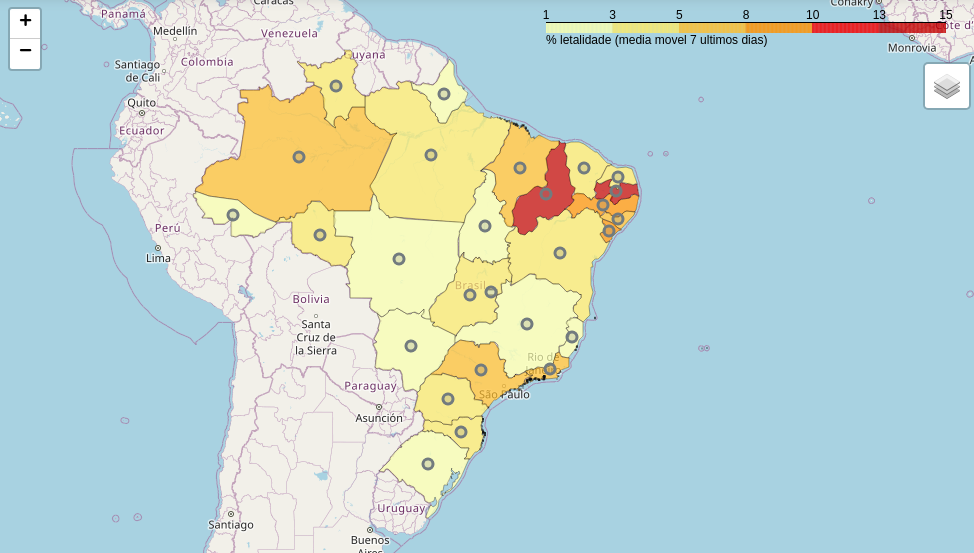

[ Versão em português](README_WORLD.md)

# **Analysis and monitoring**

### Lethality of the brazilian states
The lethality level shown in this map is defined from the moving average of the last 7 days of each state lethality.

These analysis are related to Brazil Convid19 pandemic data up to **2020-04-17**.

As there are too many states to have their data plotted together, were selected the 10 deadliest:['PB' 'PI' 'PE' 'SE' 'SP' 'RJ' 'AM' 'AL' 'MA' 'GO'].

***Tip**: you can yourself select in this notebook which states you prefer to compare.*

## Top 10 deadliest states of Brazil
|    | state   | date                |   day |   case_day |   cases |   death_day |   deaths |   avg7_cases |   avg7_deaths |   avg7_perc_death |   perc_death |
|---:|:--------|:--------------------|------:|-----------:|--------:|------------:|---------:|-------------:|--------------:|------------------:|-------------:|
|  1 | PB      | 2020-04-17 00:00:00 |    30 |         30 |     195 |           2 |       26 |           16 |             2 |             13.01 |        13.33 |
|  2 | PI      | 2020-04-17 00:00:00 |    29 |         11 |     102 |           0 |        8 |            8 |             0 |             12.87 |         7.84 |
|  3 | PE      | 2020-04-17 00:00:00 |    37 |        323 |    2006 |          26 |      186 |          188 |            17 |              9.13 |         9.27 |
|  4 | SE      | 2020-04-17 00:00:00 |    34 |          5 |      53 |           0 |        4 |            1 |             0 |              8.74 |         7.55 |
|  5 | SP      | 2020-04-17 00:00:00 |    52 |       1273 |   12841 |          75 |      928 |          660 |            55 |              7.04 |         7.23 |
|  6 | RJ      | 2020-04-17 00:00:00 |    44 |        405 |    4349 |          41 |      341 |          269 |            27 |              6.69 |         7.84 |
|  7 | AM      | 2020-04-17 00:00:00 |    34 |         90 |    1809 |          21 |      145 |          118 |            13 |              6.27 |         8.02 |
|  8 | AL      | 2020-04-17 00:00:00 |    41 |         21 |     110 |           2 |        7 |            9 |             0 |              6.02 |         6.36 |
|  9 | MA      | 2020-04-17 00:00:00 |    28 |        102 |     797 |           3 |       40 |           72 |             3 |              5.8  |         5.02 |
| 10 | GO      | 2020-04-17 00:00:00 |    36 |         17 |     335 |           0 |       16 |           20 |             1 |              5.34 |         4.78 |

 ## Top 10 most transmissible states of Brazil
|    | state   | date                |   day |   case_day |   cases |   death_day |   deaths |   avg7_cases |   avg7_deaths |   avg7_perc_death |   perc_death |
|---:|:--------|:--------------------|------:|-----------:|--------:|------------:|---------:|-------------:|--------------:|------------------:|-------------:|
|  1 | SP      | 2020-04-17 00:00:00 |    52 |       1273 |   12841 |          75 |      928 |          660 |            55 |              7.04 |         7.23 |
|  2 | RJ      | 2020-04-17 00:00:00 |    44 |        405 |    4349 |          41 |      341 |          269 |            27 |              6.69 |         7.84 |
|  3 | PE      | 2020-04-17 00:00:00 |    37 |        323 |    2006 |          26 |      186 |          188 |            17 |              9.13 |         9.27 |
|  4 | CE      | 2020-04-17 00:00:00 |    32 |        298 |    2684 |          25 |      149 |          172 |            13 |              5.03 |         5.55 |
|  5 | AM      | 2020-04-17 00:00:00 |    34 |         90 |    1809 |          21 |      145 |          118 |            13 |              6.27 |         8.02 |
|  6 | ES      | 2020-04-17 00:00:00 |    43 |        102 |     856 |           3 |       25 |           79 |             2 |              2.99 |         2.92 |
|  7 | MA      | 2020-04-17 00:00:00 |    28 |        102 |     797 |           3 |       40 |           72 |             3 |              5.8  |         5.02 |
|  8 | BA      | 2020-04-17 00:00:00 |    43 |        108 |    1059 |           6 |       36 |           65 |             2 |              3.18 |         3.4  |
|  9 | PA      | 2020-04-17 00:00:00 |    30 |        119 |     557 |           2 |       26 |           55 |             2 |              5.28 |         4.67 |
| 10 | MG      | 2020-04-17 00:00:00 |    41 |         63 |    1021 |           2 |       35 |           46 |             2 |              2.97 |         3.43 |
----------------------
## Cases and deaths

 [Comparison of Brazil and among some other contries around the world can be found here.](README_WORLD_EN.md#brazils-analysis)