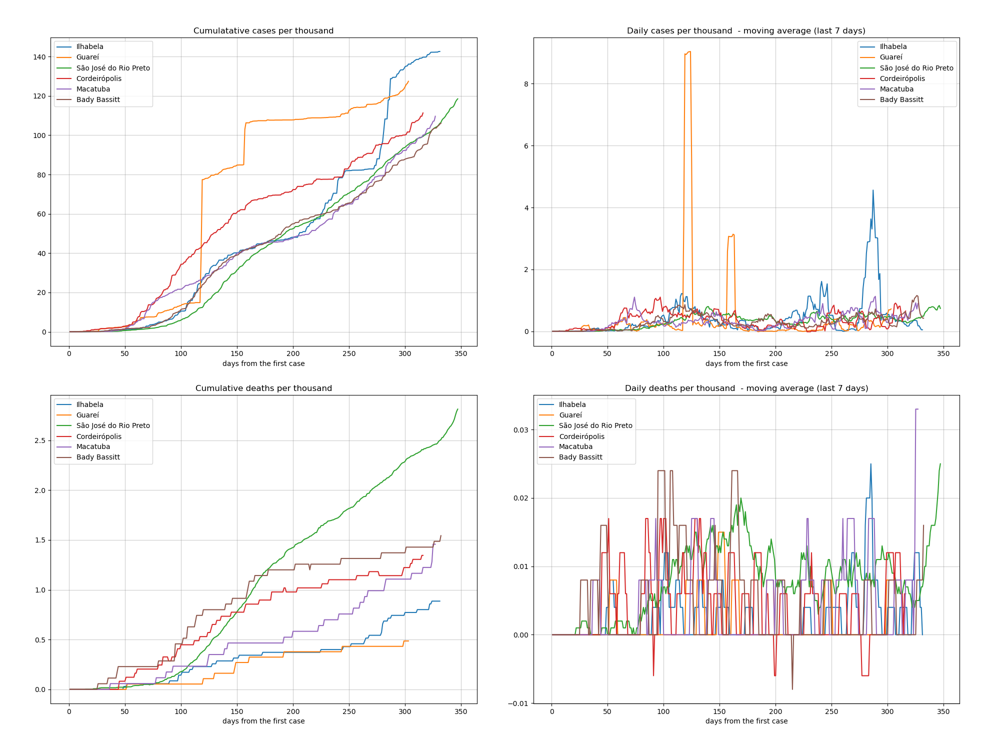

[Versão em português](README.md)

# **Analysis and monitoring**

### Lethality of the San Paulo's cities
The lethality level shown in this map is defined from the moving average of the last 7 days of each city lethality of the San Paulo state.

### Transmission of the San Paulo's cities
The tranmission level shown in this map is defined from the moving average of the last 7 days of each city's cumulative cases.

These analysis are related to state of San Paulo Convid19 pandemic data up to **2020-04-24**.

As there are too many cities to have their data plotted together, were selected the 5 deadliest:['osasco' 'sao bernardo do campo' 'guarulhos' 'santos' 'santa gertrudes'
 'lucelia'].

***Tip**: you can yourself select in this notebook which states you prefer to compare.*

## Top 5 deadliest cities of the state of San Paulo (+ Santa Gertrudes and Lucelia cities) of Brazil
|     | city                     | date                |   day |   case_day |   cases |   death_day |   deaths |   avg7_cases |   avg7_deaths |   avg7_perc_death |   perc_death |
|----:|:-------------------------|:--------------------|------:|-----------:|--------:|------------:|---------:|-------------:|--------------:|------------------:|-------------:|
|   1 | conchas                  | 2020-04-24 00:00:00 |    11 |          0 |       1 |           0 |        1 |            0 |             0 |               100 |       100    |
|   2 | caiabu                   | 2020-04-24 00:00:00 |    14 |          0 |       1 |           0 |        1 |            0 |             0 |               100 |       100    |
|   3 | santo antonio da alegria | 2020-04-24 00:00:00 |     8 |          0 |       1 |           0 |        1 |            0 |             0 |               100 |       100    |
|   4 | eldorado                 | 2020-04-24 00:00:00 |    16 |          0 |       1 |           0 |        1 |            0 |             0 |               100 |       100    |
|   5 | juquitiba                | 2020-04-24 00:00:00 |     8 |          0 |       1 |           0 |        1 |            0 |             0 |               100 |       100    |
| 144 | santa gertrudes          | 2020-04-24 00:00:00 |     9 |          0 |       1 |           0 |        0 |            0 |             0 |                 0 |         0    |
| 232 | lucelia                  | 2020-04-24 00:00:00 |     2 |          1 |       3 |           0 |        2 |            0 |             0 |                 0 |        66.67 |

 ## Top 5 most transmissible cities of state of San Paulo (+ Santa Gertrudes and Lucelia cities)
|     | city                  | date                |   day |   case_day |   cases |   death_day |   deaths |   avg7_cases |   avg7_deaths |   avg7_perc_death |   perc_death |
|----:|:----------------------|:--------------------|------:|-----------:|--------:|------------:|---------:|-------------:|--------------:|------------------:|-------------:|
|   1 | sao paulo             | 2020-04-24 00:00:00 |    28 |        575 |   11800 |          98 |     1010 |          436 |            52 |              7.58 |         8.56 |
|   2 | osasco                | 2020-04-24 00:00:00 |    27 |         16 |     389 |           4 |       42 |           23 |             3 |              9.51 |        10.8  |
|   3 | sao bernardo do campo | 2020-04-24 00:00:00 |    27 |         63 |     421 |           4 |       29 |           20 |             1 |              6.64 |         6.89 |
|   4 | guarulhos             | 2020-04-24 00:00:00 |    27 |         43 |     399 |           4 |       46 |           14 |             2 |              9.63 |        11.53 |
|   5 | santos                | 2020-04-24 00:00:00 |    25 |         35 |     367 |           0 |       19 |           13 |             0 |              5.99 |         5.18 |
| 142 | santa gertrudes       | 2020-04-24 00:00:00 |     9 |          0 |       1 |           0 |        0 |            0 |             0 |              0    |         0    |
| 238 | lucelia               | 2020-04-24 00:00:00 |     2 |          1 |       3 |           0 |        2 |            0 |             0 |              0    |        66.67 |
----------------------
## Cases and deaths

 [Comparison of San Paulo among other Brazilian states can be found here.](README_EN.md#brazils-analysis)