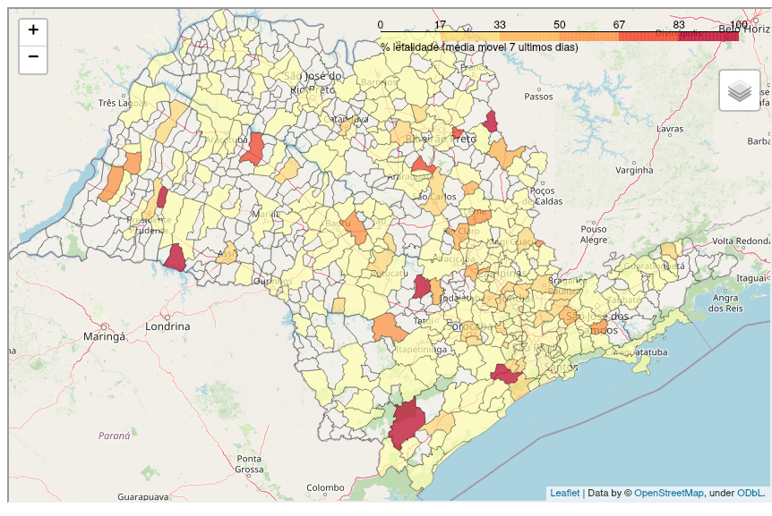
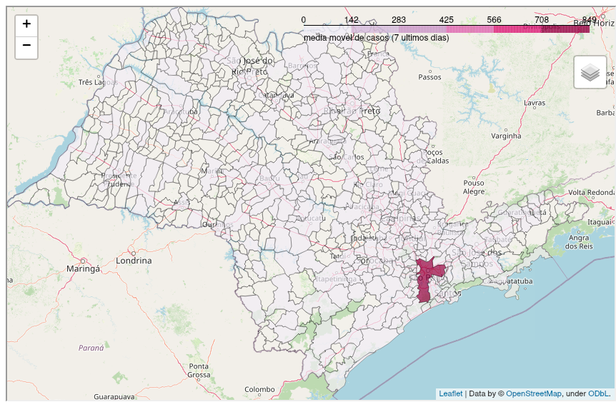
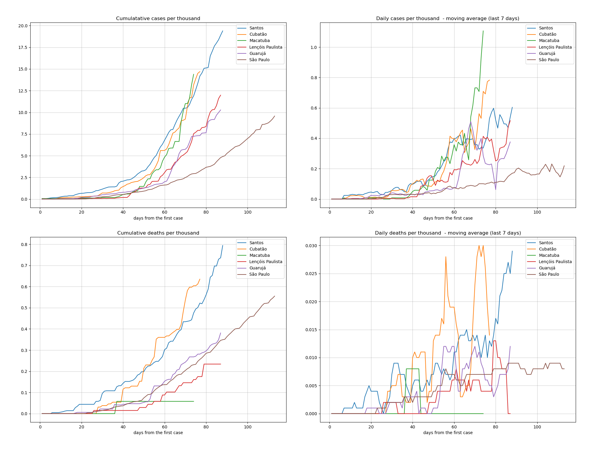

[ Versão em português](README_SP.md)

# **Analysis and monitoring**

### Lethality of the San Paulo's cities
The lethality level shown in this map is defined from the moving average of the last 7 days of each city lethality of the San Paulo state.

### Transmission of the San Paulo's cities
The tranmission level shown in this map is defined from the moving average of the last 7 days of each city's cumulative cases.

These analysis are related to state of San Paulo Convid19 pandemic data up to **2020-04-28**.

As there are too many cities to have their data plotted together, were selected the 5 deadliest:['osasco' 'sao bernardo do campo' 'guarulhos' 'santos' 'santa gertrudes'
 'lucelia'].

***Tip**: you can yourself select in this notebook which states you prefer to compare.*

## Top 5 deadliest cities of the state of San Paulo (+ Santa Gertrudes and Lucelia cities) of Brazil
|     | city                     | date                |   day |   case_day |   cases |   death_day |   deaths |   avg7_cases |   avg7_deaths |   avg7_perc_death |   perc_death |
|----:|:-------------------------|:--------------------|------:|-----------:|--------:|------------:|---------:|-------------:|--------------:|------------------:|-------------:|
|   1 | juquitiba                | 2020-04-28 00:00:00 |    12 |          0 |       3 |           0 |        3 |            0 |             0 |               100 |          100 |
|   2 | caiabu                   | 2020-04-28 00:00:00 |    18 |          0 |       1 |           0 |        1 |            0 |             0 |               100 |          100 |
|   3 | santo antonio da alegria | 2020-04-28 00:00:00 |    12 |          0 |       1 |           0 |        1 |            0 |             0 |               100 |          100 |
|   4 | conchas                  | 2020-04-28 00:00:00 |    15 |          0 |       1 |           0 |        1 |            0 |             0 |               100 |          100 |
|   5 | iepe                     | 2020-04-28 00:00:00 |    10 |          0 |       1 |           0 |        1 |            0 |             0 |               100 |          100 |
| 176 | santa gertrudes          | 2020-04-28 00:00:00 |    13 |          0 |       1 |           0 |        0 |            0 |             0 |                 0 |            0 |
| 262 | lucelia                  | 2020-04-28 00:00:00 |     6 |          0 |       4 |           0 |        2 |            0 |             0 |                 0 |           50 |

 ## Top 5 most transmissible cities of state of San Paulo (+ Santa Gertrudes and Lucelia cities)
|     | city                  | date                |   day |   case_day |   cases |   death_day |   deaths |   avg7_cases |   avg7_deaths |   avg7_perc_death |   perc_death |
|----:|:----------------------|:--------------------|------:|-----------:|--------:|------------:|---------:|-------------:|--------------:|------------------:|-------------:|
|   1 | sao paulo             | 2020-04-28 00:00:00 |    31 |       1408 |   15397 |         149 |     1321 |          722 |            81 |              8.22 |         8.58 |
|   2 | osasco                | 2020-04-28 00:00:00 |    31 |         48 |     646 |           4 |       66 |           46 |             5 |             10.15 |        10.22 |
|   3 | sao bernardo do campo | 2020-04-28 00:00:00 |    31 |         55 |     566 |           1 |       36 |           36 |             2 |              6.6  |         6.36 |
|   4 | guarulhos             | 2020-04-28 00:00:00 |    31 |         64 |     562 |           0 |       52 |           33 |             3 |             10.43 |         9.25 |
|   5 | santos                | 2020-04-28 00:00:00 |    29 |         32 |     495 |          14 |       41 |           24 |             3 |              6.1  |         8.28 |
| 172 | santa gertrudes       | 2020-04-28 00:00:00 |    13 |          0 |       1 |           0 |        0 |            0 |             0 |              0    |         0    |
| 265 | lucelia               | 2020-04-28 00:00:00 |     6 |          0 |       4 |           0 |        2 |            0 |             0 |              0    |        50    |
----------------------
## Cases and deaths

 [Comparison of San Paulo among other Brazilian states can be found here.](https://github.com/rafaelcastellar/coronavirus/blob/master/analysis/README_EN.md#cases-and-deaths)