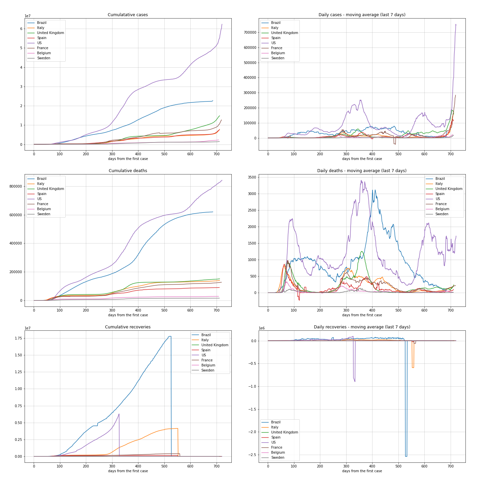

[ English version](README_WORLD_EN.md)

 #**Análises e monitoramento**
Estas análises são relativas aos dados da pandemia Covid19 até a data de **2020-04-16**.

Como existem muitos países, colocar em um gráfico todos seus dados tornaria a leitura e compreensão inviáveis, selecionei os seguintes países mais o Brasil para serem comparados entre si:['Brazil', 'Italy', 'United Kingdom', 'Spain', 'US', 'France', 'Belgium'].

Alguns países não estão no *dataset* da ONU, então não conseguimos analisá-los por sua populações. Estes podem ser encontrados fim do notebook *[data_engineering.ipynb](../data_engineering.ipynb)*.

***Dica**: você pode alterar você mesmo neste notebook quais países você prefere comparar.*

## Top 5 países mais letais + Brasil
|     | country        |   day | date                |   cases |   case_day |   deaths |   death_day |   cases_million |   deaths_million |   avg7_cases_million |   avg7_deaths_million |   avg7_recoveries_million |
|----:|:---------------|------:|:--------------------|--------:|-----------:|---------:|------------:|----------------:|-----------------:|---------------------:|----------------------:|--------------------------:|
|   1 | Belgium        |    73 | 2020-04-16 00:00:00 |   34809 |       1236 |     4857 |         417 |           107.1 |             36.1 |                  121 |                    28 |                        29 |
|   2 | San Marino     |    50 | 2020-04-16 00:00:00 |     426 |         54 |       38 |           2 |          1594.6 |             59.1 |                  392 |                    16 |                        25 |
|   3 | Andorra        |    46 | 2020-04-16 00:00:00 |     673 |          0 |       33 |           0 |             0   |              0   |                  166 |                    14 |                       205 |
|   4 | France         |    84 | 2020-04-16 00:00:00 |  147091 |      12509 |    17941 |         753 |           192.1 |             11.6 |                  131 |                    12 |                        21 |
|   5 | United Kingdom |    77 | 2020-04-16 00:00:00 |  104145 |       4662 |    13759 |         865 |            69   |             12.8 |                   80 |                    12 |                         0 |
| 140 | Brazil         |    51 | 2020-04-16 00:00:00 |   30425 |       2105 |     1924 |         188 |            10   |              0.9 |                    8 |                     0 |                         9 |

 ## Top 5 países mais transmissíveis + Brasil
|    | country    |   day | date                |   cases |   case_day |   deaths |   death_day |   cases_million |   deaths_million |   avg7_cases_million |   avg7_deaths_million |   avg7_recoveries_million |
|---:|:-----------|------:|:--------------------|--------:|-----------:|---------:|------------:|----------------:|-----------------:|---------------------:|----------------------:|--------------------------:|
|  1 | San Marino |    50 | 2020-04-16 00:00:00 |     426 |         54 |       38 |           2 |          1594.6 |             59.1 |                  392 |                    16 |                        25 |
|  2 | Ireland    |    48 | 2020-04-16 00:00:00 |   13271 |        724 |      486 |          42 |           148.3 |              8.6 |                  195 |                     6 |                         1 |
|  3 | Andorra    |    46 | 2020-04-16 00:00:00 |     673 |          0 |       33 |           0 |             0   |              0   |                  166 |                    14 |                       205 |
|  4 | France     |    84 | 2020-04-16 00:00:00 |  147091 |      12509 |    17941 |         753 |           192.1 |             11.6 |                  131 |                    12 |                        21 |
|  5 | Belgium    |    73 | 2020-04-16 00:00:00 |   34809 |       1236 |     4857 |         417 |           107.1 |             36.1 |                  121 |                    28 |                        29 |
| 52 | Brazil     |    51 | 2020-04-16 00:00:00 |   30425 |       2105 |     1924 |         188 |            10   |              0.9 |                    8 |                     0 |                         9 |
----------------------
## Análises mundiais
### Casos e mortes

 ### Casos e mortes por milhão
Milhão de população noramilza os números de modo que a comparação entre países fica mais adequada. Como podemos ver, os primeiros gráficos nos mostram quão agressivo é a pandemia na Itália e Espanha.

 ### Casos ativos, uma visão mundial, % de recuperações e letalidade

----------------------
## Análises do Brasil

 ### Casos, mortes e recuperações

 ### Médias móveis dos últimos 7 dias
