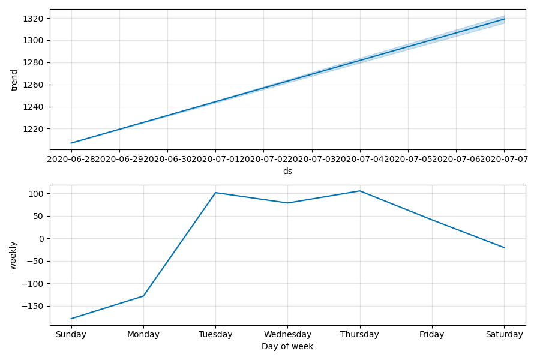

# **Predições**
Para experiência, estou fazendo predições simples sobre a quantidade de casos e mortes diárias. Como são séries temporais (*time-series*), estou usando [Facebook Prophet](https://facebook.github.io/prophet/docs/quick_start.html) que também é desenhado para este tipo de predição de uma maneira bem mais simples. Isso funciona muito bem na maioria das vezes; porém, algumas vezes há um grande salto entre os números que impactam no desempenho do modelo e leva um tempo (medições) para ser absorvido e compreendidos.

Essas predições foram feitas com os dados mundiais da pandemia Covid19 até **2020-05-05**.

Como há muitos paises para terem seus dados submetidos ao modelo de predição de uma só vez, selecionei alguns mais o Brasil:
['Brazil', 'Italy', 'United Kingdom', 'Spain', 'US', 'Belgium', 'France'].
***Dica**: você mesmo pode definir no notebook *[prediction.ipynb](../prediction.ipynb)* quais países você prefere fazer a predição.*

## A predição
As predições estão sendo realizadas sobre os dados diários de casos e de mortes. Em seguida, os dados previstos são acumulados para que tenhamos a projeção acumulada. Estão sendo previstos os próximos 10 dias.
Ao ffim, é gerado o arquivo CSV contendo todas as previsões.

#### Os últimos 5 dias da pandemia no Brasil e os próximos 10 dias previstos
*predicted? = True* significa que são dados de predição; *=False* significa que são dados reais.
|    | country   | ds                  |   case_day |   death_day |   cases |   deaths | predicted?   |
|---:|:----------|:--------------------|-----------:|------------:|--------:|---------:|:-------------|
| 65 | Brazil    | 2020-05-01 00:00:00 |       5015 |         406 |   92202 |     6412 | False        |
| 66 | Brazil    | 2020-05-02 00:00:00 |       4898 |         349 |   97100 |     6761 | False        |
| 67 | Brazil    | 2020-05-03 00:00:00 |       4726 |         290 |  101826 |     7051 | False        |
| 68 | Brazil    | 2020-05-04 00:00:00 |       6794 |         316 |  108620 |     7367 | False        |
| 69 | Brazil    | 2020-05-05 00:00:00 |       6835 |         571 |  115455 |     7938 | False        |
| 70 | Brazil    | 2020-05-06 00:00:00 |       6487 |         422 |  121942 |     8360 | True         |
| 71 | Brazil    | 2020-05-07 00:00:00 |       6775 |         462 |  128717 |     8822 | True         |
| 72 | Brazil    | 2020-05-08 00:00:00 |       6654 |         449 |  135371 |     9271 | True         |
| 73 | Brazil    | 2020-05-09 00:00:00 |       6819 |         446 |  142190 |     9717 | True         |
| 74 | Brazil    | 2020-05-10 00:00:00 |       6649 |         422 |  148839 |    10139 | True         |
| 75 | Brazil    | 2020-05-11 00:00:00 |       6994 |         443 |  155833 |    10582 | True         |
| 76 | Brazil    | 2020-05-12 00:00:00 |       7478 |         509 |  163311 |    11091 | True         |
| 77 | Brazil    | 2020-05-13 00:00:00 |       7787 |         498 |  171098 |    11589 | True         |
| 78 | Brazil    | 2020-05-14 00:00:00 |       8076 |         539 |  179174 |    12128 | True         |
| 79 | Brazil    | 2020-05-15 00:00:00 |       7955 |         526 |  187129 |    12654 | True         |

 #### As curvas acumuladas previstas para o Brasil

 O Facebook Prophet gera automaticamente gráficos do comportamento sazonal dos dados, o que provê boas informações visuais. Aqui estão sobre as predições do Brasil:
### Casos

 ### Mortes

#### Finalmente, as predições para os países selecionados para:
**Para amanhã**
|     | country        | ds                  |   case_day |   death_day |   cases |   deaths | predicted?   |
|----:|:---------------|:--------------------|-----------:|------------:|--------:|---------:|:-------------|
|  70 | Brazil         | 2020-05-06 00:00:00 |       6487 |         422 |  121942 |     8360 | True         |
|  96 | Italy          | 2020-05-06 00:00:00 |       2735 |         651 |  215748 |    29966 | True         |
|  96 | United Kingdom | 2020-05-06 00:00:00 |       5985 |         885 |  202228 |    30386 | True         |
|  95 | Spain          | 2020-05-06 00:00:00 |       5341 |         663 |  224670 |    26276 | True         |
| 105 | US             | 2020-05-06 00:00:00 |      33958 |        2259 | 1238309 |    73323 | True         |
|  92 | Belgium        | 2020-05-06 00:00:00 |       1332 |         235 |   51841 |     8251 | True         |
| 103 | France         | 2020-05-06 00:00:00 |       3123 |         690 |  173810 |    26227 | True         |

 **Para depois e amanhã** 
|     | country        | ds                  |   case_day |   death_day |   cases |   deaths | predicted?   |
|----:|:---------------|:--------------------|-----------:|------------:|--------:|---------:|:-------------|
|  71 | Brazil         | 2020-05-07 00:00:00 |       6775 |         462 |  128717 |     8822 | True         |
|  97 | Italy          | 2020-05-07 00:00:00 |       2711 |         638 |  218459 |    30604 | True         |
|  97 | United Kingdom | 2020-05-07 00:00:00 |       6074 |         886 |  208302 |    31272 | True         |
|  96 | Spain          | 2020-05-07 00:00:00 |       5295 |         640 |  229965 |    26916 | True         |
| 106 | US             | 2020-05-07 00:00:00 |      35623 |        2222 | 1273932 |    75545 | True         |
|  93 | Belgium        | 2020-05-07 00:00:00 |       1342 |         246 |   53183 |     8497 | True         |
| 104 | France         | 2020-05-07 00:00:00 |       4227 |         708 |  178037 |    26935 | True         |