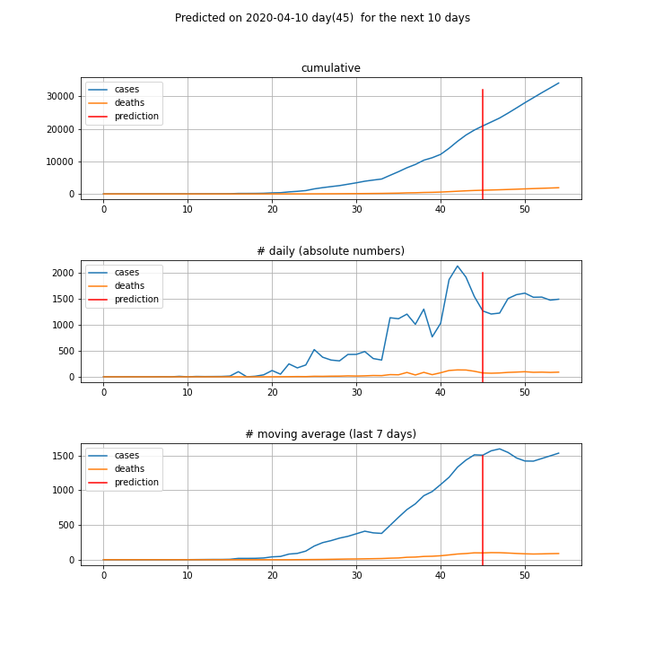
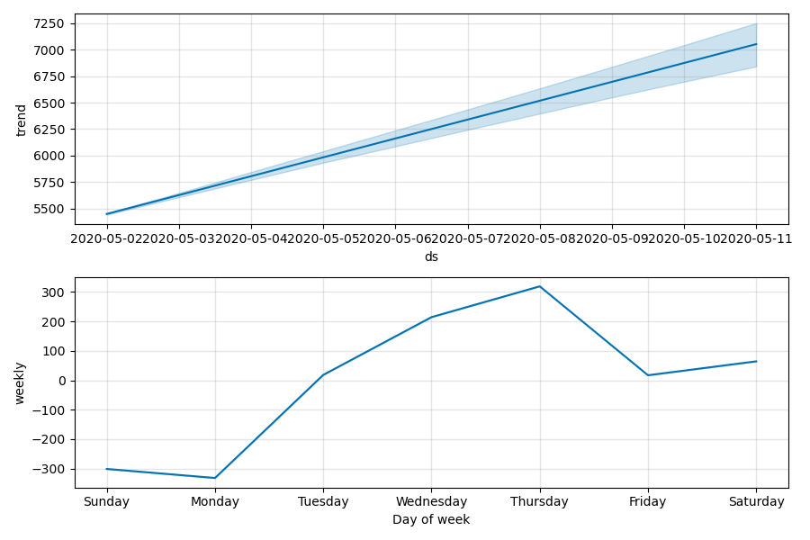
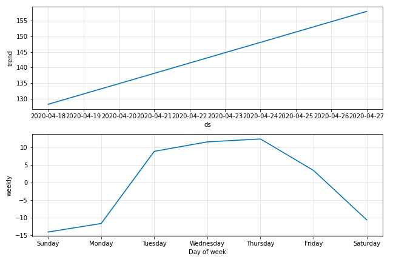

# **Predictions**
For experience, I'm running simple predictions over the cases and deaths per day. As they are time-series, I'm using [Facebook Prophet](https://facebook.github.io/prophet/docs/quick_start.html) that is also designed for this kind of prediction in a very simpler way. It works well for most of the time; sometimes there is a huge leap and it takes more time and more data to be understood.

These predictions were made with Covid19 pandemic data from **2020-06-26**.

As there are many countries to have their data predicted in a row, I selected a few of them plus Brazil to be predicted:
['Brazil', 'Italy', 'United Kingdom', 'Spain', 'US', 'Belgium', 'France'].
***Tip**: you can set yourself at the *[prediction.ipynb](../prediction.ipynb)* notebook which countries you prefer to predict*

## The prediction
As Facebook Prophet predicts time-series data and it is running the prediction over cases per day and deaths per day. After that, I compute theirs cumulatives.It is predicting for the next 10 days.
By the end, a CSV file containing all the predicted data is generated.

#### The Brazil's last 5 days and next predicted 10 days
*predicted? = True* means the line is a prediction; *=False* means they are real numbers.
|     | country   | ds                  |   case_day |   death_day |   cases |   deaths | predicted?   |
|----:|:----------|:--------------------|-----------:|------------:|--------:|---------:|:-------------|
| 117 | Brazil    | 2020-06-22 00:00:00 |      23129 |         680 | 1106470 |    51271 | False        |
| 118 | Brazil    | 2020-06-23 00:00:00 |      39436 |        1374 | 1145906 |    52645 | False        |
| 119 | Brazil    | 2020-06-24 00:00:00 |      42725 |        1185 | 1188631 |    53830 | False        |
| 120 | Brazil    | 2020-06-25 00:00:00 |      39483 |        1141 | 1228114 |    54971 | False        |
| 121 | Brazil    | 2020-06-26 00:00:00 |      46860 |         990 | 1274974 |    55961 | False        |
| 122 | Brazil    | 2020-06-27 00:00:00 |      36098 |        1187 | 1311072 |    57148 | True         |
| 123 | Brazil    | 2020-06-28 00:00:00 |      32768 |        1039 | 1343840 |    58187 | True         |
| 124 | Brazil    | 2020-06-29 00:00:00 |      33467 |        1102 | 1377307 |    59289 | True         |
| 125 | Brazil    | 2020-06-30 00:00:00 |      38206 |        1342 | 1415513 |    60631 | True         |
| 126 | Brazil    | 2020-07-01 00:00:00 |      39556 |        1332 | 1455069 |    61963 | True         |
| 127 | Brazil    | 2020-07-02 00:00:00 |      39362 |        1371 | 1494431 |    63334 | True         |
| 128 | Brazil    | 2020-07-03 00:00:00 |      41881 |        1320 | 1536312 |    64654 | True         |
| 129 | Brazil    | 2020-07-04 00:00:00 |      39747 |        1276 | 1576059 |    65930 | True         |
| 130 | Brazil    | 2020-07-05 00:00:00 |      36418 |        1128 | 1612477 |    67058 | True         |
| 131 | Brazil    | 2020-07-06 00:00:00 |      37117 |        1190 | 1649594 |    68248 | True         |

 #### The predicted Brazil's cumulative curves

Facebook's Prophet automatically generates charts about the behaviour of the analysed and predicted data. That has a good visual information. Here are for the Brazil's prediction:
### Cases

 ### Deaths

#### Finally, the predictions for selected countries for:
**Tomorrow**
|     | country        | ds                  |   case_day |   death_day |   cases |   deaths | predicted?   |
|----:|:---------------|:--------------------|-----------:|------------:|--------:|---------:|:-------------|
| 122 | Brazil         | 2020-06-27 00:00:00 |      36098 |        1187 | 1311072 |    57148 | True         |
| 148 | Italy          | 2020-06-27 00:00:00 |       -476 |         -48 |  239613 |    34660 | True         |
| 148 | United Kingdom | 2020-06-27 00:00:00 |        695 |         151 |  311946 |    43649 | True         |
| 147 | Spain          | 2020-06-27 00:00:00 |        581 |         -63 |  248849 |    28275 | True         |
| 157 | US             | 2020-06-27 00:00:00 |      29166 |         883 | 2496720 |   125922 | True         |
| 144 | Belgium        | 2020-06-27 00:00:00 |        -54 |         -22 |   61052 |     9709 | True         |
| 155 | France         | 2020-06-27 00:00:00 |       -262 |         -57 |  201922 |    29724 | True         |

 **The day after tomorrow** 
|     | country        | ds                  |   case_day |   death_day |   cases |   deaths | predicted?   |
|----:|:---------------|:--------------------|-----------:|------------:|--------:|---------:|:-------------|
| 123 | Brazil         | 2020-06-28 00:00:00 |      32768 |        1039 | 1343840 |    58187 | True         |
| 149 | Italy          | 2020-06-28 00:00:00 |       -717 |        -107 |  238896 |    34553 | True         |
| 149 | United Kingdom | 2020-06-28 00:00:00 |        642 |          12 |  312588 |    43661 | True         |
| 148 | Spain          | 2020-06-28 00:00:00 |        521 |         -75 |  249370 |    28200 | True         |
| 158 | US             | 2020-06-28 00:00:00 |      26644 |         611 | 2523364 |   126533 | True         |
| 145 | Belgium        | 2020-06-28 00:00:00 |        -91 |         -31 |   60961 |     9678 | True         |
| 156 | France         | 2020-06-28 00:00:00 |        541 |         -89 |  202463 |    29635 | True         |