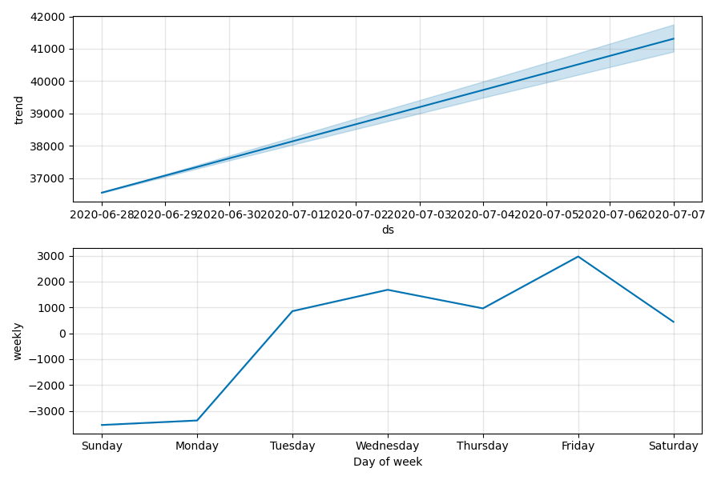

# **Predictions**
For experience, I'm running simple predictions over the cases and deaths per day. As they are time-series, I'm using [Facebook Prophet](https://facebook.github.io/prophet/docs/quick_start.html) that is also designed for this kind of prediction in a very simpler way. It works well for most of the time; sometimes there is a huge leap and it takes more time and more data to be understood.

These predictions were made with Covid19 pandemic data from **2020-05-02**.

As there are many countries to have their data predicted in a row, I selected a few of them plus Brazil to be predicted:
['Brazil', 'Italy', 'United Kingdom', 'Spain', 'US', 'Belgium', 'France'].
***Tip**: you can set yourself at the *[prediction.ipynb](../prediction.ipynb)* notebook which countries you prefer to predict*

## The prediction
As Facebook Prophet predicts time-series data and it is running the prediction over cases per day and deaths per day. After that, I compute theirs cumulatives.It is predicting for the next 10 days.
By the end, a CSV file containing all the predicted data is generated.

#### The Brazil's last 5 days and next predicted 10 days
*predicted? = True* means the line is a prediction; *=False* means they are real numbers.
|    | country   | ds                  |   case_day |   death_day |   cases |   deaths | predicted?   |
|---:|:----------|:--------------------|-----------:|------------:|--------:|---------:|:-------------|
| 62 | Brazil    | 2020-04-28 00:00:00 |       5789 |         480 |   73235 |     5083 | False        |
| 63 | Brazil    | 2020-04-29 00:00:00 |       6450 |         430 |   79685 |     5513 | False        |
| 64 | Brazil    | 2020-04-30 00:00:00 |       7502 |         493 |   87187 |     6006 | False        |
| 65 | Brazil    | 2020-05-01 00:00:00 |       5015 |         406 |   92202 |     6412 | False        |
| 66 | Brazil    | 2020-05-02 00:00:00 |       4898 |         349 |   97100 |     6761 | False        |
| 67 | Brazil    | 2020-05-03 00:00:00 |       5201 |         347 |  102301 |     7108 | True         |
| 68 | Brazil    | 2020-05-04 00:00:00 |       5343 |         367 |  107644 |     7475 | True         |
| 69 | Brazil    | 2020-05-05 00:00:00 |       5865 |         412 |  113509 |     7887 | True         |
| 70 | Brazil    | 2020-05-06 00:00:00 |       6234 |         417 |  119743 |     8304 | True         |
| 71 | Brazil    | 2020-05-07 00:00:00 |       6511 |         457 |  126254 |     8761 | True         |
| 72 | Brazil    | 2020-05-08 00:00:00 |       6381 |         444 |  132635 |     9205 | True         |
| 73 | Brazil    | 2020-05-09 00:00:00 |       6535 |         441 |  139170 |     9646 | True         |
| 74 | Brazil    | 2020-05-10 00:00:00 |       6397 |         422 |  145567 |    10068 | True         |
| 75 | Brazil    | 2020-05-11 00:00:00 |       6539 |         443 |  152106 |    10511 | True         |
| 76 | Brazil    | 2020-05-12 00:00:00 |       7062 |         487 |  159168 |    10998 | True         |

 #### The predicted Brazil's cumulative curves

Facebook's Prophet automatically generates charts about the behaviour of the analysed and predicted data. That has a good visual information. Here are for the Brazil's prediction:
### Cases

 ### Deaths

#### Finally, the predictions for selected countries for:
**Tomorrow**
|     | country        | ds                  |   case_day |   death_day |   cases |   deaths | predicted?   |
|----:|:---------------|:--------------------|-----------:|------------:|--------:|---------:|:-------------|
|  67 | Brazil         | 2020-05-03 00:00:00 |       5201 |         347 |  102301 |     7108 | True         |
|  93 | Italy          | 2020-05-03 00:00:00 |       4726 |         662 |  214054 |    29372 | True         |
|  93 | United Kingdom | 2020-05-03 00:00:00 |       6255 |         775 |  189755 |    28980 | True         |
|  92 | Spain          | 2020-05-03 00:00:00 |       5071 |         643 |  221653 |    25743 | True         |
| 102 | US             | 2020-05-03 00:00:00 |      33427 |        2101 | 1165966 |    68470 | True         |
|  89 | Belgium        | 2020-05-03 00:00:00 |       1436 |         228 |   50953 |     7993 | True         |
| 100 | France         | 2020-05-03 00:00:00 |       5159 |         573 |  173677 |    25336 | True         |

 **The day after tomorrow** 
|     | country        | ds                  |   case_day |   death_day |   cases |   deaths | predicted?   |
|----:|:---------------|:--------------------|-----------:|------------:|--------:|---------:|:-------------|
|  68 | Brazil         | 2020-05-04 00:00:00 |       5343 |         367 |  107644 |     7475 | True         |
|  94 | Italy          | 2020-05-04 00:00:00 |       4321 |         685 |  218375 |    30057 | True         |
|  94 | United Kingdom | 2020-05-04 00:00:00 |       6012 |         789 |  195767 |    29769 | True         |
|  93 | Spain          | 2020-05-04 00:00:00 |       4964 |         657 |  226617 |    26400 | True         |
| 103 | US             | 2020-05-04 00:00:00 |      33240 |        2180 | 1199206 |    70650 | True         |
|  90 | Belgium        | 2020-05-04 00:00:00 |       1285 |         223 |   52238 |     8216 | True         |
| 101 | France         | 2020-05-04 00:00:00 |       4128 |         639 |  177805 |    25975 | True         |